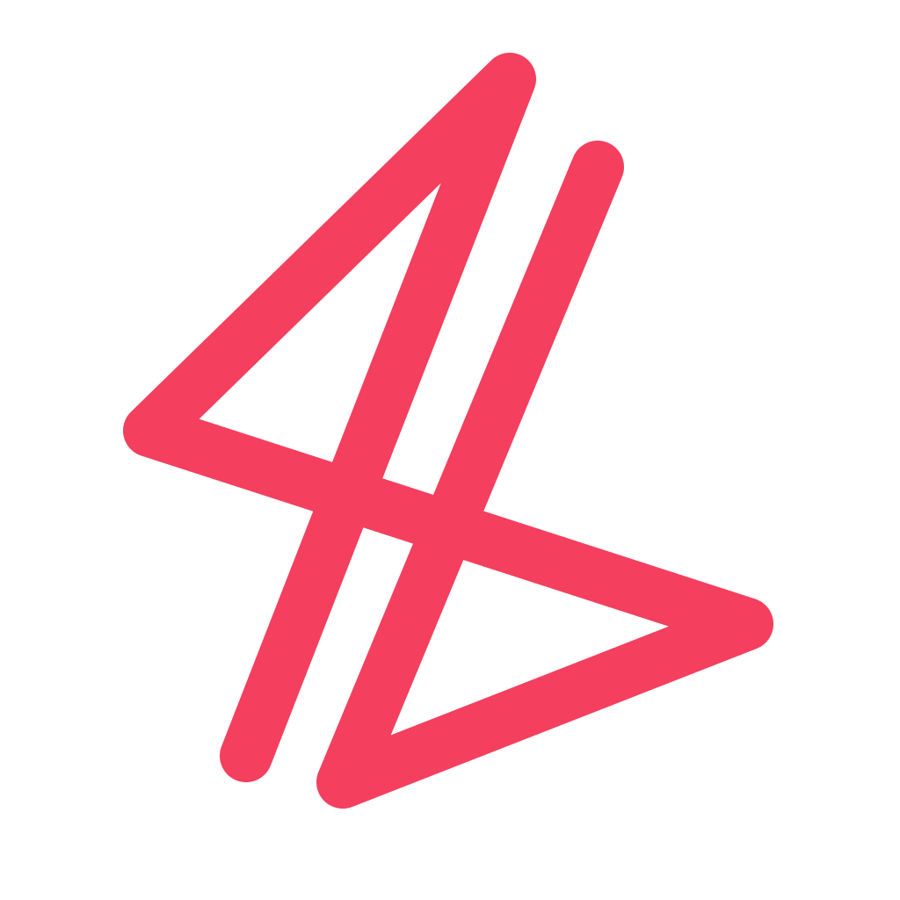

<div align="center">



# Bhavesh.ai

### Not just a portfolio. A first-person AI twin.

[](https://libralpanda.vercel.app)
[](https://libralpanda.vercel.app)
[](https://libralpanda.vercel.app)

`React 19 · Vite · Tailwind · framer-motion` &nbsp;·&nbsp; `FastAPI · LangGraph · Gemini 2.5 Flash · ChromaDB`

</div>

---

## What this is

Most portfolios are brochures. This one is a **conversation**.

Ask the AI at the bottom of the page "what did you build at TCS?" and three things happen in under a second:

1. It answers in my voice — *"At TCS I built a GenAI data-validation pipeline that cut QA time 30% and a user-provisioning REST API serving 2,600+ users…"*
2. The page scrolls you to the Experience section.
3. The chat renders a stats card inline — real numbers, grouped by project.

Ask it *"what's the weather where you live right now?"* and it calls **two tools in the same turn** — retrieves my location from my own corpus, and hits DuckDuckGo for live weather.

> The chat isn't a decoration. It's the navigation.

---

## See it live

<p align="center">
  <a href="https://libralpanda.vercel.app">
    
  </a>
  <br><em>→ try asking: "compare your Synopsys work to your TCS work"</em>
</p>

---

## Under the hood

```
                         ┌─────────────────────────────────────────┐
  user asks question ──▶ │  React 19 chat island (framer-motion)   │
                         │  • visionOS glass material              │
                         │  • Dynamic Island morph (pill ↔ stack)  │
                         │  • adaptive opacity on scroll           │
                         └──────────────┬──────────────────────────┘
                                        │ POST /chat
                                        ▼
                   ┌─────────────────────────────────────────────┐
                   │  FastAPI server  (Railway + persistent vol) │
                   └──────────────┬──────────────────────────────┘
                                  ▼
                   ┌─────────────────────────────────────────────┐
                   │  LangGraph ReAct agent                      │
                   │  (Gemini 2.5 Flash + function calling)      │
                   └─────┬──────────────────────────┬────────────┘
                         ▼                          ▼
            ┌──────────────────────┐    ┌──────────────────────┐
            │  search_profile()    │    │  search_web()        │
            │  ChromaDB vector RAG │    │  DuckDuckGo live     │
            │  role-filtered       │    │  weather/news/prices │
            └──────────────────────┘    └──────────────────────┘
                         │                          │
                         ▼                          ▼
                  12 role-tagged                5 search hits
                  markdown files                  (live)
                         │                          │
                         └────────────┬─────────────┘
                                      ▼
                ┌──────────────────────────────────────────────┐
                │  final JSON                                  │
                │    { answer, scroll_to, component, source }  │
                └──────────────────────────────────────────────┘
                                      │
                                      ▼
                        frontend renders reply +
                        scrolls to section +
                        inlines a stats / comparison / list
                        / timeline / cards / quote / code viz
```

---

## Why the chat is different

<details>
<summary><strong>🧠  Role-filtered RAG — no cross-role hallucinations</strong></summary>

Every knowledge chunk is tagged with a `role` metadata field (`tcs`, `synopsys`, `esec`, `gdsc`, `nyuad`, `personal`, `projects`, `leadership`, `publication`). The `search_profile` tool accepts an optional `role` arg and Chroma's `where={"role": ...}` filter enforces isolation.

A prior-era bug: asking about *Synopsys* pulled TCS chunks because both had "GenAI pipeline" vectors nearby. Role-filtered retrieval plus a system-prompt rule ("never attribute facts across roles") eliminates this class of error.
</details>

<details>
<summary><strong>🤖  True agentic loop — not a binary router</strong></summary>

Built with LangGraph's ReAct pattern, not a hard-coded if/else. The LLM sees both tools and decides — on its own, per-question — which to call, whether to call both in parallel, or neither.

Tested behavior:
| Question | Tools invoked | `source` |
|---|---|---|
| "what's at TCS?" | `search_profile` | `profile` |
| "what is LangGraph?" | `search_web` | `web` |
| "weather where you live?" | `search_profile + search_web` (parallel) | `both` |
| "hey" | (none) | `profile` |

The system prompt has a "hard rule — don't announce, act" to prevent *"let me check…"* empty promises without tool calls.
</details>

<details>
<summary><strong>🎨  Dynamic response components — not just text</strong></summary>

The agent returns structured JSON. The final field, `component`, can be any of seven shapes:

```ts
type Component =
  | { type: "stats",      title, data: { items: [{label, value, sub}]  } }
  | { type: "timeline",   title, data: { items: [{date, title, desc}] } }
  | { type: "cards",      title, data: [{title, desc, tags}]           }
  | { type: "comparison", title, left:{title,points}, right:{...}      }
  | { type: "list",       title, data: { items: [...] }                }
  | { type: "code",       title, data: { language, code }              }
  | { type: "quote",      title, data: { text, attribution }           }
```

Gemini picks the shape that best fits the question. Ask "compare X vs Y" → comparison block; ask "list your wins" → list; ask "what numbers did TCS hit?" → stats tiles.

The frontend `<DynamicComponent>` is shape-tolerant — accepts both `data: [...]` and `data: { items: [...] }` emissions, and both `component.data.left` and `component.left` for comparisons.
</details>

<details>
<summary><strong>💾  Persistent thread memory</strong></summary>

LangGraph `MemorySaver` + per-session `thread_id`. Follow-ups like *"and the biggest technical challenges there?"* correctly resolve "there" to the prior topic (verified: 2-turn TCS thread recalls the full context).
</details>

---

## Why the UI is different

<details>
<summary><strong>🪟  Dynamic Island chat that actually morphs</strong></summary>

- **Idle**: 288 × 52 pill at the bottom — "Ask me anything…"
- **Active** (hover / focus / typing): spring-morphs to a 720-wide glass island with suggestion chips and input.
- **Conversing**: same island grows vertically to hold messages; each bubble springs into view via framer-motion `layout`.
- **Adaptive opacity**: when you scroll the page the island fades to 35% + 1.5% scale-down + 0.4px blur. Restores instantly on hover/focus.

All surfaces use a visionOS-style glass material — `backdrop-filter: blur(32px) saturate(200%)`, layered fractal-noise overlay, inset highlight border, radial color aura that shifts state-by-state (rose idle → amber thinking → emerald "just replied").
</details>

<details>
<summary><strong>🖋️  Scroll-driven signature watermark</strong></summary>

Inspired by [scroll-driven-animations.style](https://scroll-driven-animations.style/). The brand signature mark grows from 0.8× to 3.6×, rotates -6°, and fades from 22% → 6% opacity *as the hero exits the viewport*. By the time you're reading about the Synopsys internship, my signature is a huge faded watermark behind the page. Built with `useScroll` + `useSpring` for smooth GPU-composited animation.
</details>

<details>
<summary><strong>🌗  True theme system</strong></summary>

Not `dark:` class soup. A single CSS-variable palette (`--color-bg`, `--color-surface`, `--color-ink`, `--color-accent`, `--color-border-rgb`…) stored as RGB triplets, flipped by toggling `:root.light` vs `:root.dark`. Tailwind's theme is extended with semantic tokens (`bg-surface`, `text-ink`, `border-subtle`) that hit those variables with `<alpha-value>` support.

Ships with localStorage persistence, OS-preference fallback, animated sun↔moon toggle.
</details>

<details>
<summary><strong>🪐  Always-on ambient motion</strong></summary>

Three heavily-blurred radial orbs (rose, amber, blue) drift behind content on 55/72/85-second loops. Uses `mix-blend-plus-lighter` so they layer warmly. GPU-composited `transform` only — zero layout thrash while scrolling.
</details>

<details>
<summary><strong>💳  One-tap vCard download</strong></summary>

The hero QR code isn't decorative. Click → downloads a proper RFC-6350 `.vcf` file. iOS / Android / macOS Contacts / Gmail / Outlook all recognize it and offer to add me to your address book. There's a matching "business card" on the Contact section with a prominent "Save Contact" CTA.
</details>

---

## Tech stack

| Layer | Stack |
|---|---|
| Frontend | React 19, Vite (rolldown), Tailwind 3, framer-motion 12, lucide-react, react-router |
| Backend  | Python 3.12, FastAPI, LangGraph, langchain-google-genai, ChromaDB, ddgs |
| AI       | Gemini 2.5 Flash (chat + function calling), gemini-embedding-001 (vector embeddings) |
| Hosting  | **Frontend:** Vercel · **Backend:** Railway with 1 GB persistent volume |

---

## Getting started

### Prereqs
- Node ≥ 18
- Python 3.12 (some deps lack 3.13 wheels)
- A free Gemini API key → [aistudio.google.com/apikey](https://aistudio.google.com/apikey)

### Frontend

```bash
git clone https://github.com/bhaveshgupta01/TerminalPortfolio.git
cd TerminalPortfolio
npm install
cp .env.local.example .env.local   # then set VITE_AGENT_API if running backend remotely
npm run dev                         # http://localhost:5173
```

### Backend

```bash
cd backend
python3.12 -m venv venv && source venv/bin/activate
pip install -r requirements.txt
cp .env.example .env                # paste your GOOGLE_API_KEY
python ingest.py --reset            # builds ChromaDB from knowledge/
python server.py                    # FastAPI on :8000
```

### Smoke test

```bash
curl -sX POST http://localhost:8000/chat \
  -H 'content-type: application/json' \
  -d '{"question":"what did you build at TCS?"}' | jq
```

Expected: a first-person reply citing 2,600+ users / 26M+ weekly transactions / 99.2% uptime / 30% QA reduction, `scroll_to: "experience"`, and a cards component.

### Update the knowledge corpus later

Edit any file in `backend/knowledge/`, push, then either:
- wipe the Chroma volume in Railway → next boot auto-ingests, or
- set an `INGEST_SECRET` env var and hit `POST /admin/ingest` with the `X-Ingest-Secret` header to re-ingest without redeploying.

---

## Repository layout

```
TerminalPortfolio/
├── src/
│   ├── components/
│   │   ├── ChatIsland.jsx         — Dynamic Island morphing surface
│   │   ├── DynamicComponent.jsx   — 7 live component types (stats, timeline, cards…)
│   │   ├── BackgroundAmbient.jsx  — drifting orbs
│   │   ├── ScrollDrivenLogo.jsx   — scroll-linked watermark
│   │   ├── BrandMark.jsx          — brand tile (logo + glow)
│   │   ├── LogoIcon.jsx           — 6-point signature SVG
│   │   └── ThemeToggle.jsx        — sun↔moon
│   ├── context/ThemeContext.jsx   — localStorage + prefers-color-scheme
│   ├── lib/vcard.js               — RFC-6350 vCard generator + download
│   ├── pages/
│   │   ├── Home.jsx               — sidebar + 9 sections + chat island
│   │   └── Design.jsx             — glass gallery + lightbox
│   └── index.css                  — design tokens + glass utilities
├── backend/
│   ├── agent.py                   — LangGraph ReAct + Gemini tool calling
│   ├── ingest.py                  — role-tagged Chroma ingest
│   ├── server.py                  — FastAPI /chat + /health + /admin/ingest
│   └── knowledge/                 — 12 role-tagged markdown files
└── vercel.json                    — SPA rewrites
```

---

## Philosophy

> *"Rather than owning some mindless AI tool, I want to create tools that help every domain of industry — things that truly solve real problems."*

Three words I try to live by: **Selfless. Persistent. Respectable.**

Not chasing hype. Building for impact.

---

## Credits

- Signature mark: hand-drawn, traced to SVG
- visionOS glass inspiration: Apple Vision Pro UI language
- Scroll-driven logo: adapted from [scroll-driven-animations.style](https://scroll-driven-animations.style/)
- Agent architecture: LangGraph ReAct pattern
- QR VCard trick: RFC 6350

<div align="center">

Built by [Bhavesh Gupta](https://linkedin.com/in/bhaveshgupta01) · MSCS @ NYU Courant · GA @ NYUAD NY

`bg2896@nyu.edu`

</div>
